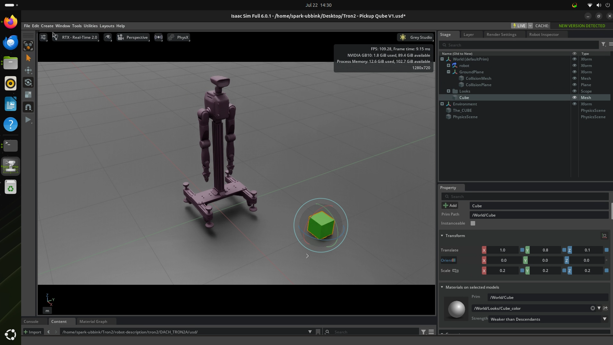

# Vision-to-Pointing Development Roadmap

| Item | Value |
|------|-------|
| **Author** | Arjen van Dijk |
| **Date** | 22-07-2026 |
| **Operating System** | Ubuntu 24.04 |
| **Isaac Sim** | 6.0.1 |
| **Hardware** | NVIDIA GB10 Grace Blackwell Superchip |

---

## Objective

Inspect the imported TRON 2 robot, verify that the articulation behaves correctly under physics and prepare a simple reference scene that will be used throughout Phase 1.

---

## Robot Inspection

The imported Stage hierarchy was inspected manually.

All joints and links are present and correctly named.

The left and right arm link hierarchy matches the expected robot structure and can be used later when scripting joint control and inverse kinematics.

The robot imported with valid collision meshes and correctly configured joint limits.

---

## Physics Validation

To verify the articulation behaviour, the wrist was temporarily configured with a constand force.

When simulation started, the hand swung naturally under gravity.

The following observations were made:

- Joint limits behave correctly.
- Passive motion looks natural.
- Self-collision behaves correctly.
- No unstable behaviour or exploding physics was observed.

The imported robot is therefore considered mechanically stable for future development.

---

## Reference Cube

A simple cube primitive was added to act as the reference object for all Phase 1 experiments.

Primitive:

`Cube`

Scale:

```
0.2
0.2
0.2
```

Position:

```
X = 1.0
Y = 0.8
Z = 0.1
```

Material:

`OmniPBR`

Colour:

`#19FF00`

The cube is intentionally static and will later be moved through Python scripts instead of manually.

Using a simple coloured cube removes unnecessary complexity while developing the coordinate transformation and motion planning pipeline.

---

## Pointing Origin

For the remainder of Phase 1, the centre of the gripper will be used as the reference point for pointing.

This point is easy to identify in both simulation and the real robot and provides a consistent reference for future inverse kinematics experiments.

---

## Findings

The imported robot behaves correctly inside Isaac Sim.

Joint limits and self-collision work as expected.

The articulation is stable during physics simulation.

The bright green reference cube provides a deterministic target for all future experiments.

The current scene is now ready for Python scripting.

---

## Figure



---

## Next Step

Continue with **Phase 1.3 – Read the Cube Position**.

The next objective is to write a Python script that continuously reads the cube position from Isaac Sim and prints its world coordinates while the cube is moved around the scene.
