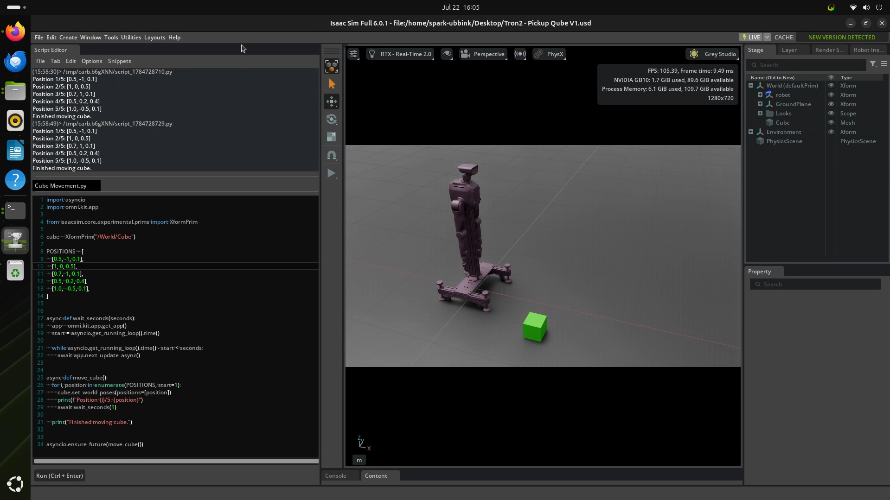

# Vision-to-Pointing Development Roadmap

| Item | Value |
|------|-------|
| **Author** | Arjen van Dijk |
| **Date** | 22-07-2026 |
| **Operating System** | Ubuntu 24.04 |
| **Isaac Sim** | 6.0.1 |
| **Hardware** | NVIDIA GB10 Grace Blackwell Superchip |

---

## Objective

Create the first Python script for Isaac Sim.

The objective is to automatically move the reference cube between five predefined positions. This verifies that Python can successfully control objects inside the simulation while it is running.

---

## Opening the Script

Open the **Script Editor**.

If the **Window → Script Editor** menu is not visible, verify that the **Script Editor** extension is enabled under the **Extensions** menu.

Once the Script Editor is open:

**File → Open**

Open the following script:

```text
/home/spark-ubbink/Desktop/Cube Movement.py
```

The Python code for this experiment is stored in this file.

---

## Important

> [!WARNING]
> **Never use `time.sleep()` inside Isaac Sim Python scripts.**
>
> `time.sleep()` blocks Isaac Sim's main update loop and will cause the simulator to freeze or become unresponsive while the script is running.
>
> Instead, always wait asynchronously by yielding control back to Isaac Sim:
>
> ```python
> await omni.kit.app.get_app().next_update_async()
> ```
>
> The `wait_seconds()` function used in the script below implements this correctly.

---

## Cube Movement Script

The following Python script moves the reference cube through five predefined positions.

```python
import asyncio
import omni.kit.app

from isaacsim.core.experimental.prims import XformPrim

cube = XformPrim("/World/Cube")

POSITIONS = [
    [0.5, -1.5, 0.1],
    [2.0, -1.5, 0.1],
    [2.0,  1.5, 0.1],
    [0.5,  1.5, 2.0],
    [1.0,  0.8, 0.1],
]


async def wait_seconds(seconds):
    app = omni.kit.app.get_app()
    start = asyncio.get_running_loop().time()

    while asyncio.get_running_loop().time() - start < seconds:
        await app.next_update_async()


async def move_cube():
    for i, position in enumerate(POSITIONS, start=1):
        cube.set_world_poses(positions=[position])
        print(f"Position {i}/5: {position}")
        await wait_seconds(5)

    print("Finished moving cube.")


asyncio.ensure_future(move_cube())
```

---

## Result

After executing the script, the cube automatically moves through five predefined world positions.

Each position is held for approximately five seconds before continuing to the next.

The movement is performed while the simulation is running and without requiring any physics components on the cube.

The Script Editor console prints the current target position after each movement.

---

## Findings

The `XformPrim` API provides a reliable method for manipulating object transforms during simulation.

Using asynchronous waiting allows the simulation to continue updating while the script is running.

This experiment confirms that Python can directly control objects inside Isaac Sim, providing the foundation for future robot control and vision-based experiments.

---

## Figure



---

## Next Step

Continue with **Phase 1.4 – Read the Cube Position**.

The next objective is to write a Python script that continuously reads the cube position from Isaac Sim and prints its world coordinates while the cube is moved manually around the scene.
