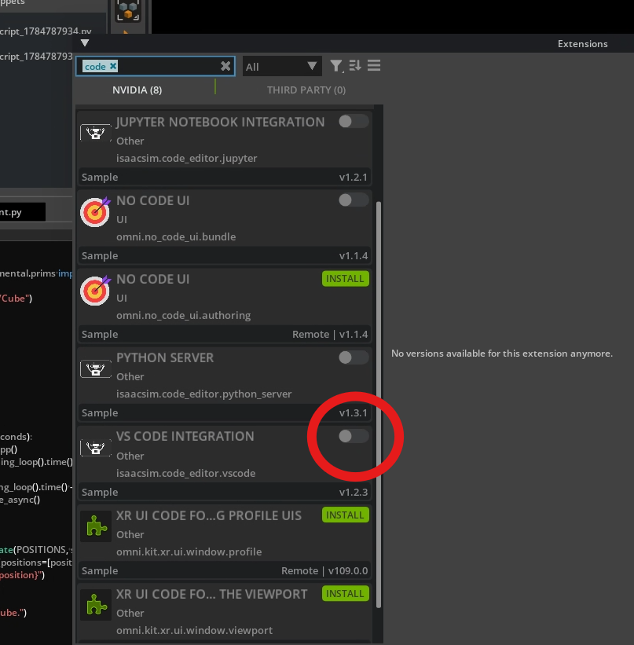
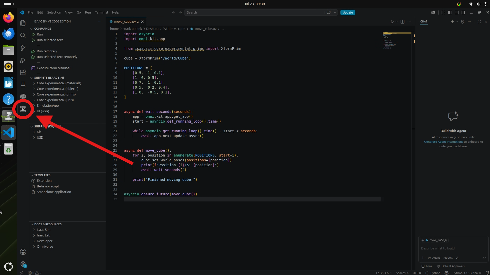
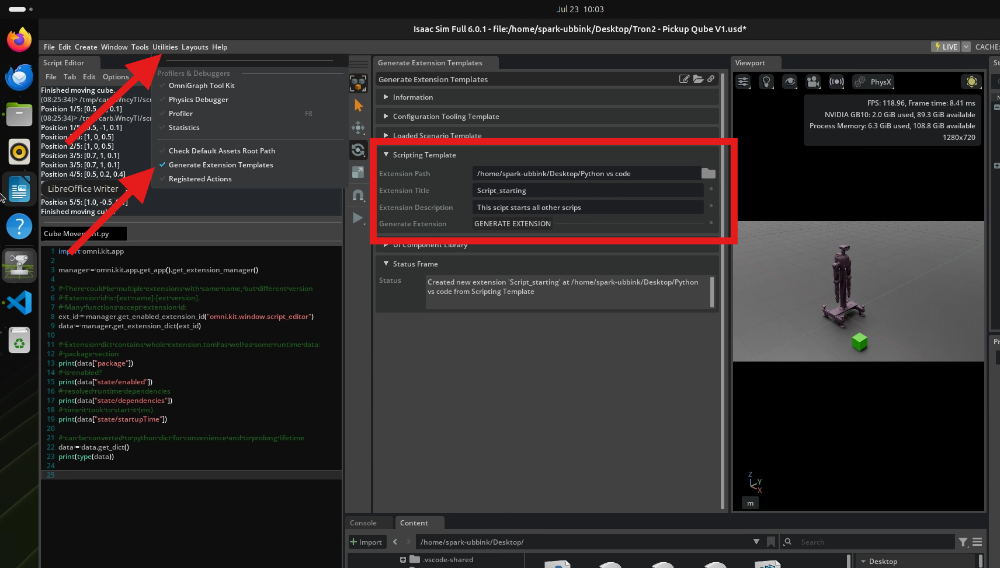
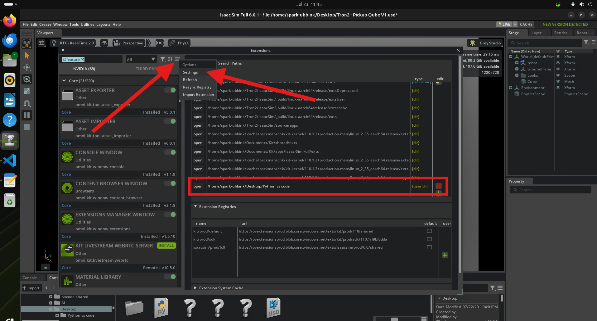
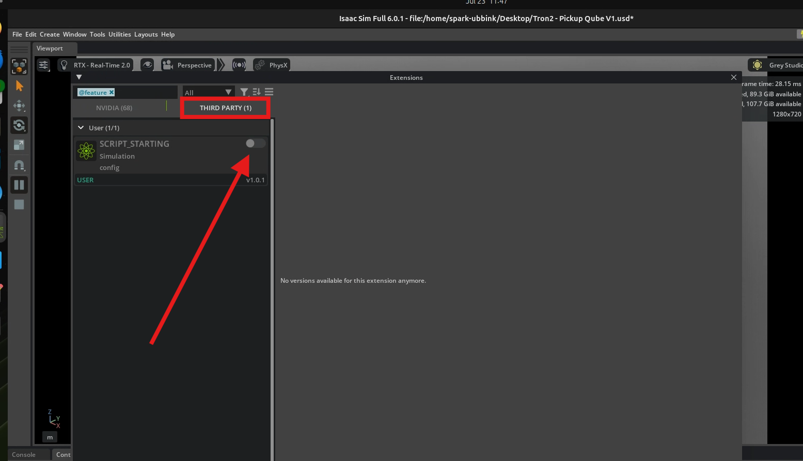

# Vision-to-Pointing Development Roadmap

| Item | Value |
|------|-------|
| **Author** | Arjen van Dijk |
| **Date** | 23-07-2026 |
| **Operating System** | Ubuntu 24.04 |
| **Isaac Sim** | 6.0.1 |
| **Hardware** | NVIDIA GB10 Grace Blackwell Superchip |

---

## Objective

Move Python development from the built-in Isaac Sim Script Editor to Visual Studio Code.

Using VS Code provides a full development environment with syntax highlighting, project management, version control and debugging while still executing the Python code inside the running Isaac Sim instance.

---

## Enable the Isaac Sim VS Code Integration

Open **Isaac Sim**.

Navigate to:

```text
Window → Extensions
```

Search for:

```text
isaacsim.code_editor.vscode
```

Enable the extension.

This allows Visual Studio Code to communicate directly with the running Isaac Sim instance.



---

## Install the VS Code Extension

Open **Visual Studio Code**.

Open the **Extensions** marketplace.

Install:

```text
Isaac Sim VS Code Edition
```

Publisher:

```text
NVIDIA
```

---

## Create the Python Script

Create a new file:

```text
/ home/spark-ubbink/Desktop/Python vs code/move_cube.py
```

Copy the following script into the file.


??? note "move_cube.py"

    ```python
    --8<-- "assets/code/move_cube.py"
    ```

Save the file.

---

## Run the Script

Open the **Isaac Sim** extension from the left-hand activity bar in Visual Studio Code.

Open:

```text
move_cube.py
```

Click:

```text
Run
```

The script is executed directly inside the running Isaac Sim instance.

The cube should immediately move through the predefined positions while the simulation continues running.



---

## Generate an Extension Template

Return to **Isaac Sim**.

Navigate to:

```text
Utilities → Generate Extension Templates
```

Fill in the following values.

| Field | Value |
|------|------|
| **Extension Path** | `/home/spark-ubbink/Desktop/Python vs code/Script_starting_extension` |
| **Extension Title** | `Script_starting` |
| **Description** | `This script starts all other scripts.` |

**Note:**
The extension must be generated inside its own dedicated folder (for example Script_starting_extension). Generating it directly into your general development directory may prevent Isaac Sim from loading the extension correctly.

Click:

```text
Generate Extension
```


Isaac Sim creates a new extension project containing the required boilerplate for future development.

The generated project contains folders such as:

```text
config/
data/
docs/
Script_starting_python/
```

The Script_starting_python folder contains:

```text
extension.py
global_variables.py
__init__.py
scenario.py
ui_builder.py
README.md
```

This project will be used as the foundation for creating a controller that automatically starts when the simulation begins and stops when the simulation ends.
These files are already filled with an example project and need to be altered for our controller.

---

Navigate to:
```text
/home/spark-ubbink/Desktop/Python vs code/Script_starting_extension/Script_starting_python
```
Two files need to be changed, and one file needs to be added, within this folder.

---

Open:
```text
ui_builder.py
```
Replace it with:

??? note "ui_builder.py"

```python
    --8<-- "assets/code/ui_builder.py"
```

---

Open:
```text
scenario.py
```
Replace it with:

??? note "scenario.py"

```python
    --8<-- "assets/code/scenario.py"
```

---

Add a new file to the same folder, saved as:
```text
cube_demo.py
```

??? note "cube_demo.py"

```python
    --8<-- "assets/code/cube_demo.py"
```

---

We have now generated and built our own extension for Isaac Sim.
The next step is to point Isaac Sim to its location.

---

Open **Isaac Sim**.

Navigate to:

```text
Window → Extensions → Hamburger Icon → Settings
```

A window with Extension Search Paths should appear. Add our new extension path here.

Add the following path:

```text
/home/spark-ubbink/Desktop/Python vs code
```



---

After adding the path, a new THIRD PARTY extension should appear. Activate it.



---

Close the extensions menu. A new item has appeared in the top bar:

```text
Script_starting
```

Clicking on it opens our own TRON2 Controller dashboard. From here, `cube_demo.py` can be toggled.
This script will now autostart when the simulation starts, and stop together with the simulation.
