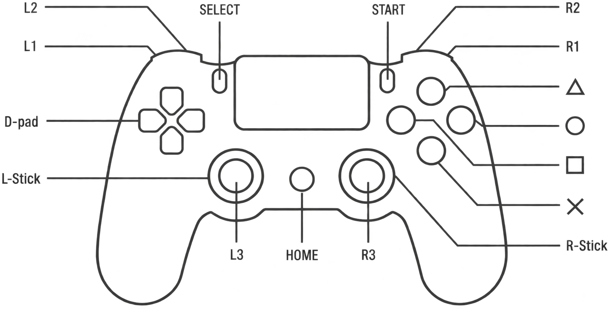
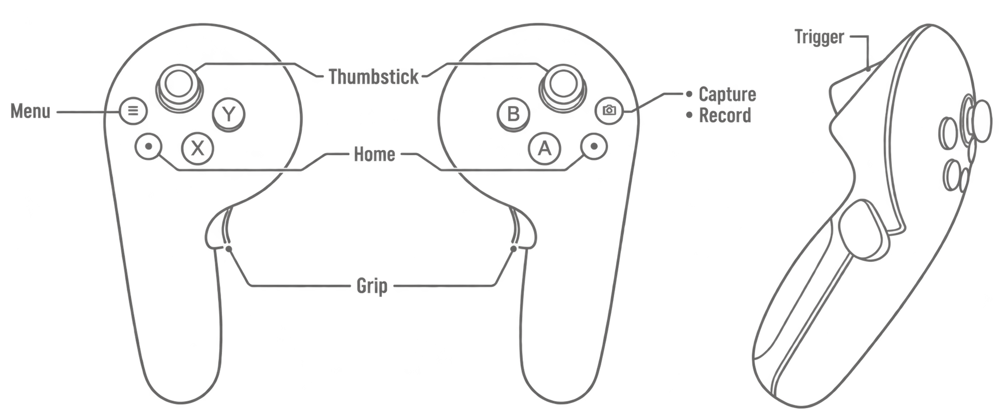

# Controller and VR headset

This page maps the official handheld and VR controls for the configurations covered by the TRON 2 User Manual.

!!! danger "Read before operating"

    These mappings are **official-source summaries, not Ubbink-verified instructions**. Confirm the robot configuration, clear the operating area, keep the physical emergency stop accessible, and start at low risk. Several emergency commands cause the robot to drop. Read [Safety](../getting-started/safety.md) and the [emergency-stop procedure](../operation/emergency-stop.md).

## Handheld controller

<figure class="controller-layout" markdown>

</figure>

The controller has a D-pad, two joysticks with push buttons, face buttons (`△`, `○`, `×`, `□`), shoulder buttons (`L1`, `L2`, `R1`, `R2`), a display, and a power button. The display reports radio signal, controller battery, robot state information, and current mode.

### Common and dual-arm commands

| Purpose | Input | Required state | Important behavior |
| --- | --- | --- | --- |
| Change mode | `R1` + right face button | Idle | Cycles VR teleoperation / developer mode |
| Return action | `L1` + `×` | Remote-control or high-level developer mode | Lowers/returns arms, then enters idle |
| Enter idle immediately | `L1` + `□` | Global | Skips return action; joints enter damping and the robot can drop. Emergency use only |
| Emergency stop | Push both joystick buttons | Global | Motor drives are cut immediately; the robot can drop |
| Release controller e-stop | Push right joystick button | E-stop state | Manual release enters damping state; Ubbink recovery requires a [full power cycle](../operation/emergency-stop.md#after-an-e-stop) |
| Zero calibration | `L1` + `R1` | Idle | Only after controller upgrade or confirmed zero-position loss/drift; follow the full manual procedure |

## VR teleoperation

<figure class="controller-layout controller-layout--vr" markdown>

<figcaption>VR controller layout with front and side views.</figcaption>

</figure>

The manual identifies the supported EDU teleoperation device as a PICO 4 Ultra. The two VR controllers provide joysticks, grip buttons, triggers, face buttons, and home/menu controls.

### Dual-arm VR controls

| Purpose | Input | Required state |
| --- | --- | --- |
| Start teleoperation / establish initial zero | Hold both grip buttons for more than 1 s | Robot in VR teleoperation mode |
| Return arms to initial zero | Hold both `X` & `A` for more than 1 s | Active teleoperation |
| Reset camera to initial zero | Hold both `inside buttons` for more than 1 s | Active teleoperation |
| Move end effectors | Move the held VR controllers | Initial-zero or active teleoperation state |
| Pause/resume left arm | Left-controller `X` | Initial-zero or active teleoperation state |
| Pause/resume right arm | Right-controller `A` | Initial-zero or active teleoperation state |
| Toggle left gripper | Left trigger | Initial-zero or active teleoperation state |
| Toggle right gripper | Right trigger | Initial-zero or active teleoperation state |
| Start data collection | Right-controller `B` | Active teleoperation |
| Stop data collection | Right-controller `B` again | Collection active |

## Preparing a VR session

1. Confirm the exact robot configuration and the supported headset/application version.
2. Complete robot startup and confirm the area is clear.
3. Put the robot into VR teleoperation mode using the handheld controller.
4. Connect the headset using the approved robot network profile. Credentials and fixed addresses are intentionally not published here.
5. Start the official teleoperation application and verify its target robot before granting control.
6. Establish the initial-zero state, verify both arms at low risk, then begin work.

!!! note "Calibration is exceptional"

    The manual says zero calibration is required only after a controller upgrade or severe impact causing zero-position loss or drift. It is not a normal startup step.

## Local motor-release observation

The September route tests found that normal software could bring the arms to rest but could not release the motors. The manual action was L1+X. This specific observation does not verify every button mapping in the tables above. [Client safety](../deployment/client-safety.md#motor-release-remains-manual).

## Source

LimX Dynamics, *TRON 2 User Manual*, TRON 2 EDU edition, v0.1, 11 June 2026, sections 4 and 5. Tables are paraphrased; consult the source for complete prerequisites, warnings, and illustrations.
