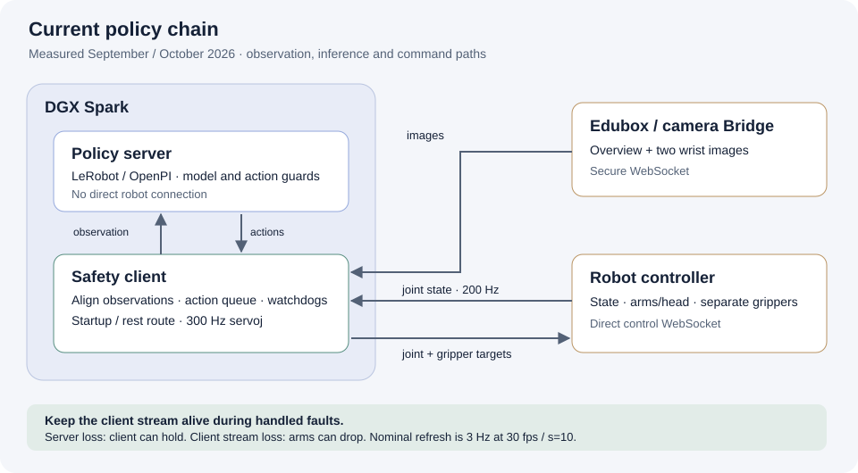

# Current deployment architecture

**Measured September/October setup:** both the policy server and the safety client run on the DGX Spark. The onboard Edubox provides camera Bridge services; robot state and commands use the controller connection.

## Responsibilities

| Component | Responsibility |
| --- | --- |
| Spark policy server | Load LeRobot or OpenPI model; preprocess observations; predict and inspect actions |
| Spark client | Select/validate policy, align observations, maintain queue, handle faults, run startup/rest route |
| Edubox / image Bridge | Provide camera images |
| Robot controller connection | Provide joint state; receive arm/head and separate gripper commands |
| PICO headset | Physical teleoperation and demonstration recording |
| Simulation workstation/Spark | Separate simulation workflows; hardware support depends on the selected stack |

The server never communicates directly with the robot. A healthy client can hold the last target after server failure. Losing its servoj stream can drop the arms, which is why fault handling lives in the client.

The earlier general overview and deployment proposal placed the client on the onboard computebox. That arrangement is historical; it must not overwrite the later measured placement.

## Three different jobs

- **Physical teleoperation:** PICO talks to the robot's teleoperation service.
- **Policy inference:** camera/state observations reach the Spark client and model server.
- **Simulation teleoperation:** CloudXR/workstation requirements are a separate route.

Do not infer that the LimX PICO app is built on NVIDIA Isaac Teleop merely because the headset is supported by both.

Continue with [Observations and playback](observation-pipeline.md), [Client safety](../deployment/client-safety.md) or the [simulation route](../simulation/index.md).

**Source:** [UBB-CLIENT-001](document-sources.md), section 16.1; [UBB-POL-001](document-sources.md), section 17.8; earlier stack overview retained as a dated source.
